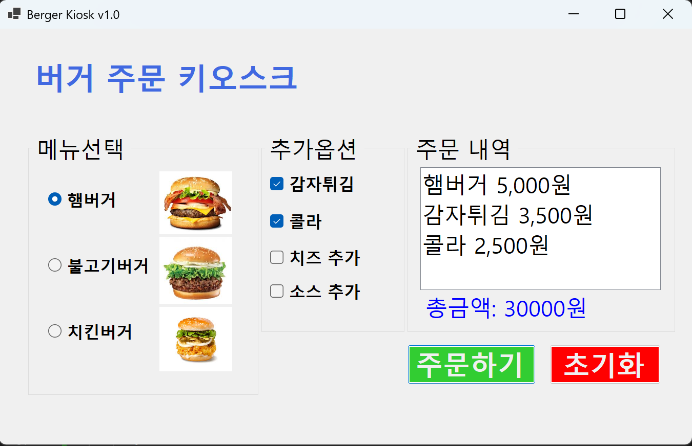
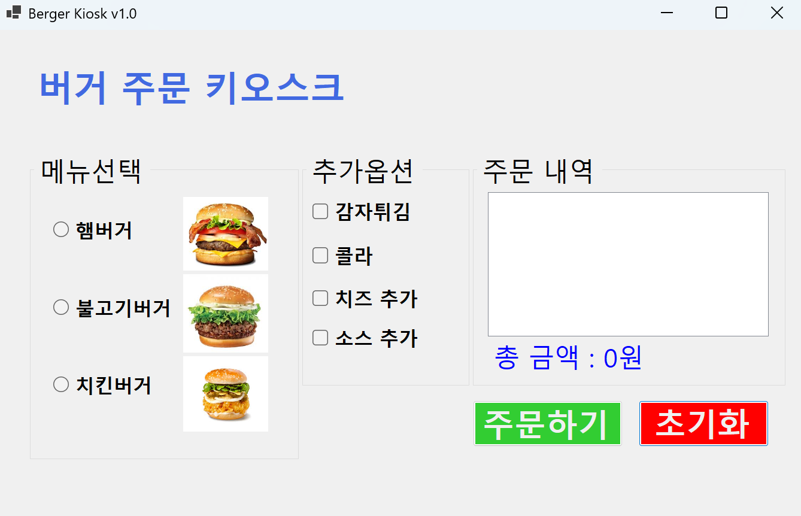
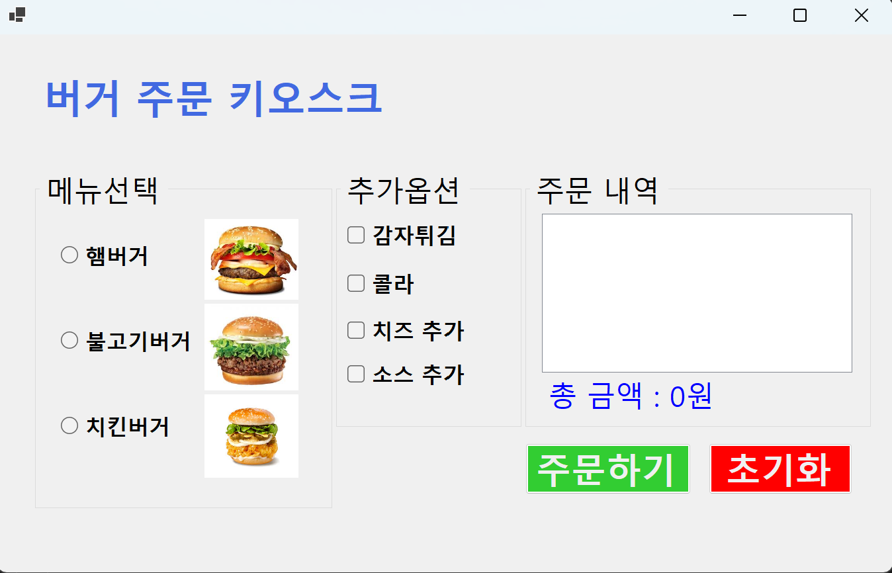
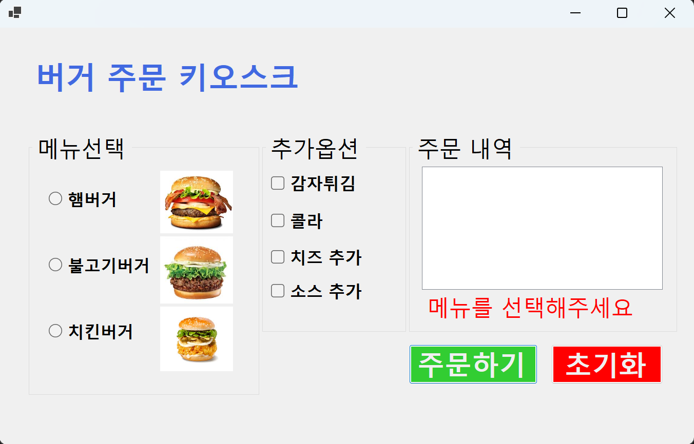
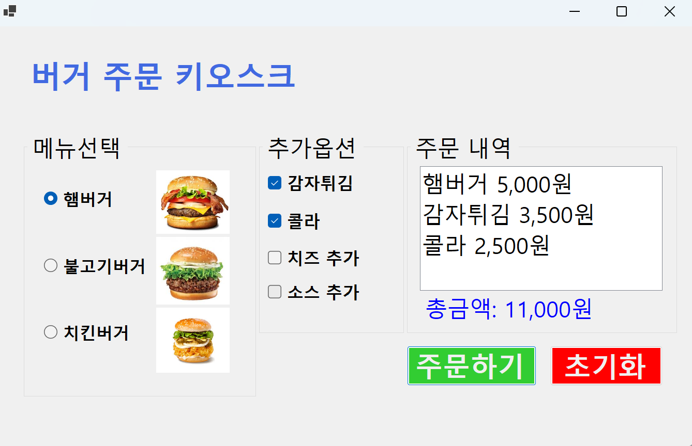
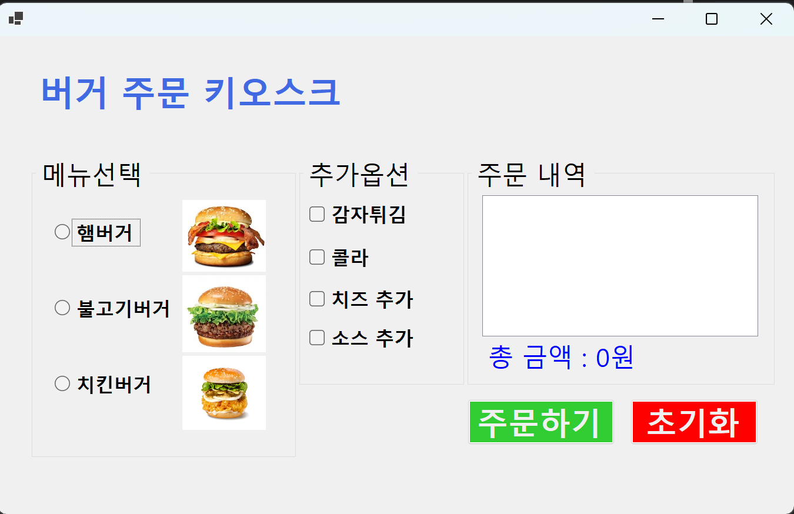
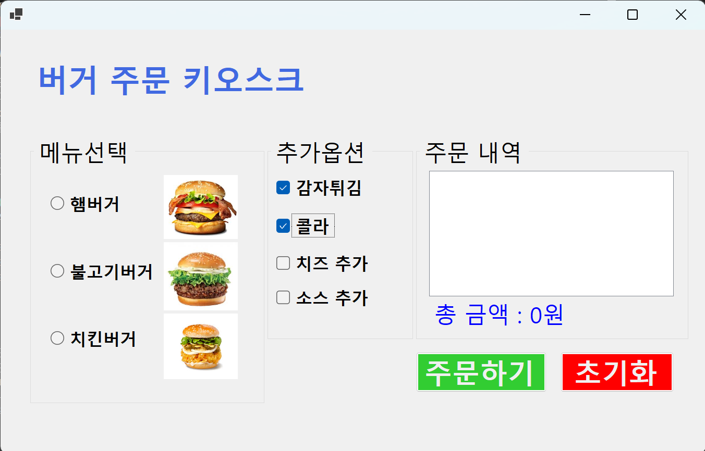
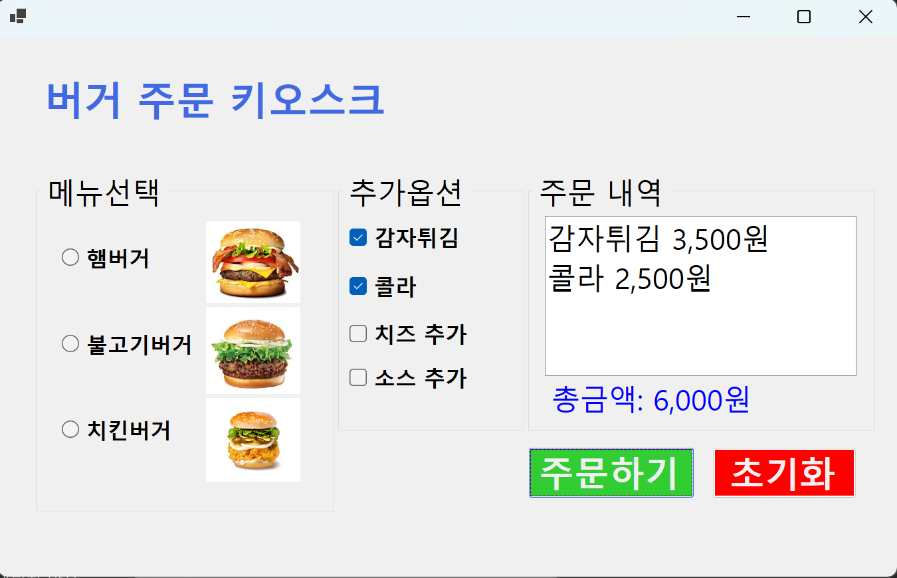
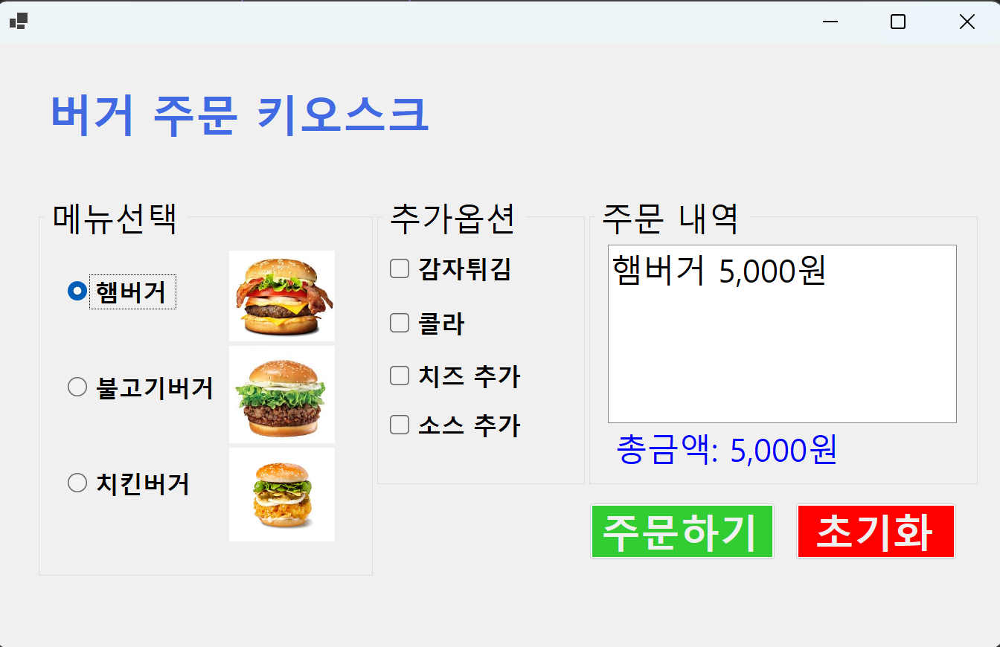
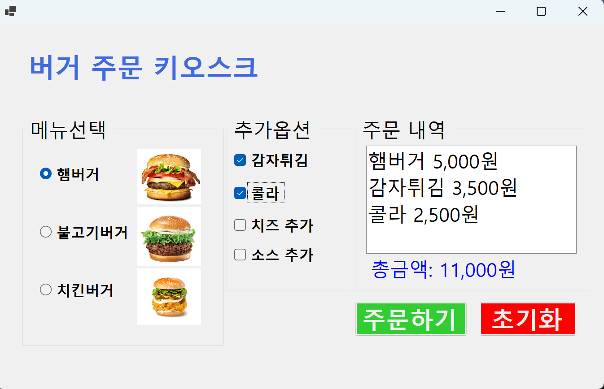

## 개요
- C# 프로그래밍 학습
- 1줄 소개: 메뉴와 추가옵션을 선택하는 키오스크 주문 화면
- 사용한 플랫폼:
  - C#, .NET Windows Forms, Visual Studio, GitHub
- 사용한 컨트롤:
  - TextBox, Button, Label
- 사용한 기술과 구현한 기능
  - RadioButton을 활용한 단일 메뉴 선택
  - CheckBox를 활용한 추가 옵션 선택
  - TextBox를 활용한 주문 내역과 총 금액 표시
  - Button을 활용한 주문 완료 기능 구현
  - 주문 내역과 총 금액 계산 로직 구현 
  - 초기화 기능 구현
  - Tab 키를 이용한 GroupBox 사이 이동
  - 방향키를 이용한 RadioButton과 CheckBox 사이 이동
  - 스페이스바를 이용한 RadioButton과 CheckBox 선택
  - Enter 키로 주문하기 버튼과 초기화 버튼 누르기
  - 실시간으로 ListBox에 주문 내역 표시
  - 실시간으로 Label에 전체 가격 정보 표시
  - 에러 메시지 표시 기능 구현
  - 총 금액에 , 표시
  - 최초 실행 시 아무 옵션도 선택되지 않은 상태로 시작
  
  
## 실행 화면 (과제1)
-  과제1 코드의 실행 스크린샷

- 과제 내용
  - UI 구성
	- ▶RadioButton과CheckBox 등을 적절히 배치합니다.
	- ▶GroupBox로 적절하게 그룹으로 묶습니다.
  - 주문하기 버튼과 초기화버튼의 기능구현
	- ▶주문내역과 총 금액을 표시합니다. 
	- ▶다시 주문할 수 있도록 초기화합니다.

- 구현 내용과 기능 설명
  - RadioButton과 CheckBox를 활용하여 메뉴와 추가 옵션을 선택할 수 있도록 UI를 구성하였습니다. 
  - GroupBox를 사용하여 메뉴와 추가 옵션을 그룹으로 묶어 사용자에게 명확한 선택지를 제공하였습니다. 
  - 주문하기 버튼을 클릭하면 선택된 메뉴와 추가 옵션에 따라 주문 내역과 총 금액이 TextBox에 표시되도록 구현하였습니다. 
  - 초기화 버튼을 클릭하면 모든 선택이 초기화되고 주문 내역과 총 금액이 초기 상태로 돌아가도록 구현하였습니다.  

## 실행 화면 (과제2)
-  과제2 코드의 실행 스크린샷

- 과제 내용
  - 아무것도 선택하지 않고 주문하기 버튼을 누르면 에러 메시지 표시
	- MessageBox 사용보다는 Label 사용하는게 좋음

- 구현 내용과 기능 설명
  - 총 금액에 , 표시하였습니다.
  - 주문하기 버튼을 클릭했을 때, 메뉴나 추가 옵션이 선택되지 않은 경우 Label을 사용하여 에러 메시지를 표시하도록 구현하였습니다.
  - 최초 실행 시 아무 옵션도 선택되지 않은 상태로 시작하도록 설정하였습니다.

## 실행 화면 (과제3)
-  과제3 코드의 실행 스크린샷

- 과제 내용
  - Tab을 이용해서 GroupBox사이를 이동하기
  - 방향키를 이용해서 선택 아이템 사이를 이동하기
  - 스페이스바를 이용해서 아이템 선택하기
  - Enter키로 버튼을누르기

- 구현 내용과 기능 설명
  - Tab 키를 이용하여 GroupBox 사이를 이동할 수 있도록 설정하였습니다.
  - 방향키를 이용하여 RadioButton과 CheckBox 사이를 이동할 수 있도록 설정하였습니다.
  - 스페이스바를 이용하여 현재 선택된 RadioButton이나 CheckBox를 선택할 수 있도록 설정하였습니다.
  - Enter 키로 주문하기 버튼과 초기화 버튼을 누를 수 있도록 설정하였습니다.

## 실행 화면 (과제4)
-  과제4 코드의 실행 스크린샷

- 과제 내용
  - 선택하는순간 ListBox에 주문내역이 표시되도록
  - 선택하는순간 Label에 전체가격 정보가 표시되도록

- 구현 내용과 기능 설명
  - RadioButton과 CheckBox를 선택하는 순간 ListBox에 주문 내역이 실시간으로 표시되도록 구현하였습니다.
  - RadioButton과 CheckBox를 선택하는 순간 Label에 전체 가격 정보가 실시간으로 표시되도록 구현하였습니다.
  - 주문하기 버튼을 클릭하면 최종 주문 내역과 총 금액이 TextBox에 표시되도록 구현하였습니다.